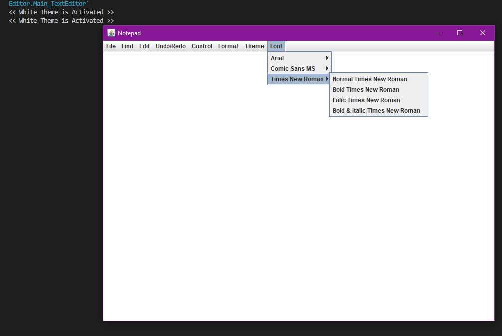

# TextEditor
 This is a text editor app. Works like .txt

###  Main Version

 

###  File button

 

###  Find button

 

###  Undo/Redo button

 

###  Control (TypoFixer) button

 

###  Format (Word Wrap) button

 

###  Theme button

| White						     | Blue                                           |
| -------------------------------------------------- | ---------------------------------------------- |
|       |    |

| Dark                                               | Pink                                           |
| -------------------------------------------------- | ---------------------------------------------- |
|        |    |

###  Fonts button

 

